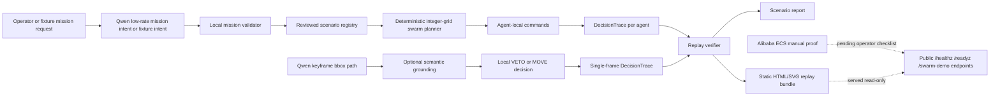

# Accountable Swarm Architecture

Issue: #55

## Claim Boundary

This architecture is for the current judge-facing simulated swarm path. It does
not describe a physical robot deployment, SO-101 operation, DimOS integration,
3D physics, latency measurement, reliability measurement, or completed Alibaba
ECS deployment.

Qwen is outside the real-time control loop. Local deterministic code owns the
execution boundary.

## Diagram



## Runtime Roles

| Component | Role | Claim |
| --- | --- | --- |
| Qwen mission intent | Produces a bounded natural-language objective in the live mission suite | Checked for `qwen-plus` across the reviewed five-scenario registry |
| Mission validator | Rejects hidden counts, scenario names, coordinates, arrays, and control terms inside objective text | Checked by unit tests and issue #52 evidence |
| Scenario registry | Restricts execution to reviewed local scenarios | Checked for `corridor`, `center-block`, `vertical-slalom`, `horizontal-slalom`, `double-chicane` |
| Swarm planner | Deterministic integer-grid planner with local collision and obstacle guards | Checked for four agents in the reviewed scenarios |
| DecisionTrace | Hash-chained event evidence for mission and agent decisions | Checked by replay verifiers |
| Static replay bundle | Judge-facing HTML/SVG and JSON summary generated from persisted traces | Checked by `scripts/build_swarm_demo_bundle.py` evidence |
| Minimal server | Serves existing artifacts and smoke endpoints | Checked locally; ECS proof pending |

## Data Flow

1. A mission request is either fixture-backed or produced by live Qwen text mode.
2. The local mission validator accepts only an intent-style `objective`.
3. Local code binds the reviewed scenario, mission id, agent count, and tick
   budget.
4. The deterministic integer-grid simulator runs local planner commands.
5. Each agent writes a `DecisionTrace`.
6. Verifiers reload persisted traces from disk and recompute summary hashes.
7. Reports and static replay pages are generated from verified artifacts.

## Real-Time Boundary

The current demo has no physical real-time control. The architectural rule is
still explicit:

```text
Qwen may suggest low-rate semantic intent.
Qwen may not directly command motion.
Local deterministic code owns every executable movement decision.
```

This boundary is why the current demo can be replayed and audited from persisted
trace artifacts.

## Evidence Links

- `docs/submission/README.md`
- `docs/engineering/swarm-demo-bundle-2026-06-15.md`
- `docs/engineering/live-dashscope-swarm-mission-suite-post-hardening-2026-06-15.md`
- `docs/engineering/swarm-mission-objective-hardening-2026-06-15.md`
- `docs/engineering/swarm-mission-suite-tamper-2026-06-15.md`
- `docs/engineering/alibaba-ecs-manual-deploy-2026-06-15.md`
- `docs/engineering/current-status-2026-06-15.md`

## Non-Claims

- No physical robot behavior.
- No SO-101 operation.
- No 3D physics simulation.
- No latency or reliability claim.
- No DimOS integration.
- No completed Alibaba ECS deployment proof.
- No Qwen real-time control.
- No arbitrary-map planner claim.
- No larger-swarm claim beyond the reviewed deterministic four-agent
  integer-grid cases.
