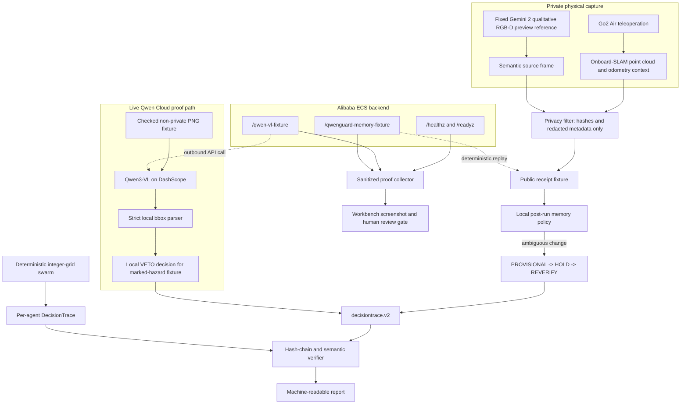

# Accountable Swarm Architecture

Source state reviewed: `a62c78ff8c1c82e73686afb18fcb52cf64c77a1b`.

## Claim Boundary

The Track 5 hero path is an accountable edge-cloud evidence loop, not autonomous
Qwen robot control. Qwen Cloud handles low-rate semantic work. Strict local code
validates its output, owns policy, and emits replayable evidence. The Go2 capture
was teleoperated, and the checked memory sequence is a post-run simulation.

The deterministic swarm is a secondary local demonstration of the same trace
architecture. It is an integer-grid simulation, not physical or physics-backed
swarm evidence.

## Diagram



The diagram shows two separate evidence paths. The privacy-safe Go2 memory
replay is deterministic and does not make a paid model call. The live
`/qwen-vl-fixture` path calls Qwen Cloud with a generated public fixture. The
submission needs both the Qwen code path and Alibaba deployment evidence, but
they must not be presented as one synchronized physical run.

## Runtime Roles

| Component | Role | Checked boundary |
| --- | --- | --- |
| Go2 Air capture | Supplies teleoperated context receipts from recorded onboard-SLAM and odometry streams | No Qwen-directed motion; no raw L1 LiDAR claim |
| Gemini 2 | Fixed independent semantic reference with a qualitative, independently normalized depth preview | Not metric depth, not mounted on the Go2, and not frame-synchronized with it |
| Public memory fixture | Stores hashes, dimensions, model-coordinate boxes, and provenance | No raw hotel imagery or capture databases |
| Qwen Cloud client | Calls the DashScope OpenAI-compatible API for low-rate text or image semantics | API key stays in the environment; no onboard or real-time-control claim |
| Qwen response validator | Rejects malformed JSON, invalid normalized boxes, and base-URL overrides that are non-HTTPS or contain credentials, a query, or a fragment | External model output is never trusted as a motion command |
| Local memory policy | Applies the deterministic `VERIFIED -> PROVISIONAL -> HOLD -> REVERIFY` simulation | The phases did not run in the physical robot runtime |
| DecisionTrace | Hash-chains evidence and local decisions | Verifier checks both hash integrity and replay semantics |
| Minimal ECS backend | Exposes health, live-Qwen fixture, and deterministic memory-replay endpoints | Deployment code alone is not visual proof of a running Alibaba resource |
| ECS proof collector | Binds public endpoint checks to deployed commit and ECS metadata | Promotion requires `outcome: GO`, sanitized evidence, and human review |
| Integer-grid swarm | Secondary deterministic planner and visualization | Four reviewed local agents only; no physics or hardware claim |

## Data Flow

### Privacy-safe physical-data replay

1. A human teleoperates the Go2 while the Go2 and fixed Gemini 2 collect
   separate sources.
2. Private source media and databases remain outside the public repository.
3. The public fixture retains only hashes and redacted metadata needed to
   reproduce policy decisions.
4. Local code rebuilds the exact four-phase no-motion policy sequence.
5. The verifier rejects missing phases, altered receipts, motor authority, or
   inconsistent trace/report artifacts.

### Live Qwen Cloud check

1. The backend loads a generated, non-private PNG fixture.
2. `DashScopeQwenClient` calls `qwen3-vl-flash` through the public
   compatible-mode API.
3. Local code validates the returned normalized model coordinates and label.
4. A successful marked-hazard response becomes a local `VETO` and
   `DecisionTrace`; it never becomes a direct actuator command.
5. The ECS collector checks this path together with backend health and the
   deterministic memory replay.

### Secondary simulated swarm

1. Qwen or a fixture may propose bounded low-rate mission intent.
2. Local code binds that intent to a reviewed scenario registry.
3. The deterministic integer-grid planner emits one trace per agent.
4. Verifiers reload the persisted traces before reports and replay pages are
   promoted.

## Edge / Cloud Split

```text
Cloud: low-rate semantic proposal only.
Edge/local: validation, policy, fallback, planning, trace, and replay.
Motors: never controlled by Qwen in the recorded demo.
```

The live fixture endpoint fails closed with a controlled `502` or `503` when
the cloud result or key is unavailable. Separately selected degraded paths can
record local `HOLD`. Neither path grants motion authority.

## Submission Proof Status

The repository provides the API integration, Docker deployment surface, public
smoke collector, and proof-review helper. Final Alibaba proof is not asserted by
this document. Promotion still requires:

1. a sanitized ECS collector report with `proof_mode: ecs-public` and
   `outcome: GO` from the final deployed commit;
2. a screenshot of the running Alibaba Cloud resource in Workbench; and
3. explicit human review of the proof and final video.

## Evidence Links

- [submission and judge quickstart](README.md)
- [Qwen Cloud client](../../accountable_swarm/qwen/client.py)
- [Go2 memory replay evidence](../engineering/qwenguard-go2-memory-replay-2026-07-18.md)
- [ECS smoke collector](../engineering/ecs-smoke-proof-collector-2026-06-15.md)
- [ECS proof review helper](../engineering/ecs-proof-review-helper-2026-06-29.md)
- [deterministic swarm demo](../engineering/swarm-demo-bundle-2026-06-15.md)
- [threat model](../security/threat-model.md)

## Non-Claims

- no autonomous or Qwen-directed Go2 motion;
- no Qwen execution onboard or in the real-time motor loop;
- no claim that the replay phases ran in the robot runtime;
- no raw hotel media or public raw capture database;
- no calibrated cross-device synchronization, pixel displacement, or 3D
  grounding;
- no raw L1 LiDAR claim;
- no perception-accuracy, safety, latency, or reliability claim;
- no physics-backed or physical swarm claim;
- no completed Alibaba deployment-proof claim until all proof gates above are
  satisfied.
